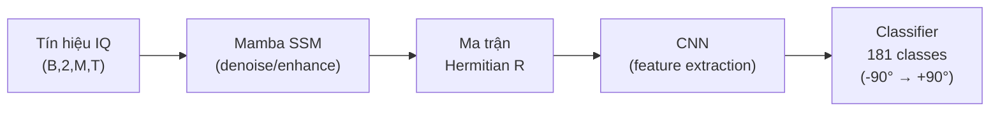
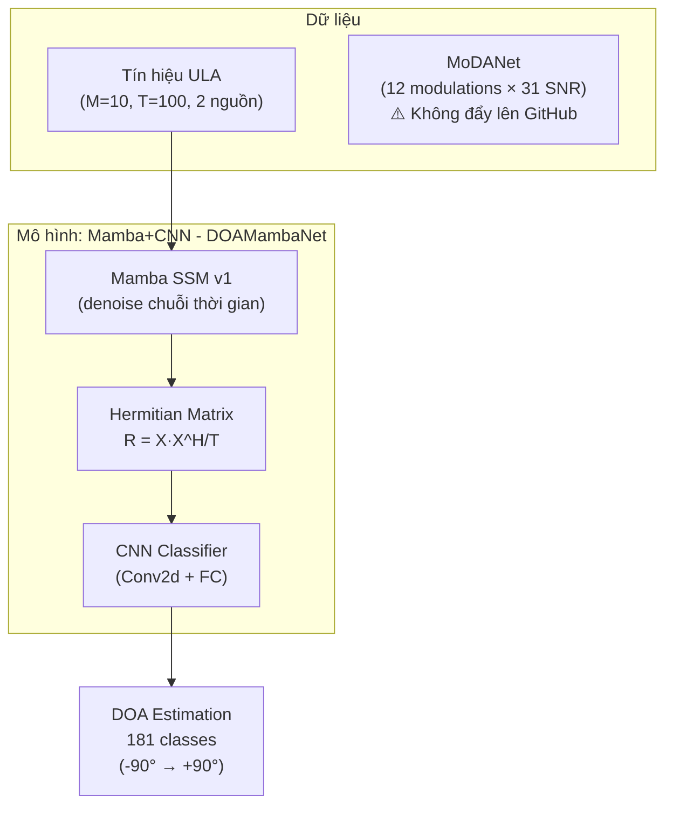

# 📡 Tổng Quan Dự Án: Mamba + CNN cho Ước Lượng DOA

> **Cập nhật lần cuối**: 16/09/2026 — 11:02 (GMT+7)

---

## 📋 Lịch Sử Cập Nhật

| Thời gian | Nội dung |
|-----------|----------|
| **15/09/2026 — 22:22** | Tạo bản tổng quan đầu tiên, phân tích cấu trúc dự án gốc |
| **15/09/2026 — 22:34** | Xác nhận thư viện Mamba được clone từ GitHub (`state-spaces/mamba`), license Apache 2.0 |
| **15/09/2026 — 22:48** | Rà soát file thừa: xác định `tmp_*.py`, `__pycache__/`, `.vscode/`, checkpoint trùng lặp cần xóa |
| **16/09/2026 — 09:30** | Xác nhận bản quyền: Mamba (Apache 2.0), Code DOA (được tặng), MoDANet (mua từ IEEE DataPort) |
| **16/09/2026 — 09:58** | Tạo `.gitignore` chặn dataset MoDANet, file `.npy`, `.pth`, `__pycache__/`, `.vscode/` |
| **16/09/2026 — 10:06** | Dọn dẹp cấu trúc: bỏ lồng thư mục `mamba-main-20260909.../mamba-main/mamba-main/` → `mamba-main/` |
| **16/09/2026 — 10:10** | Khởi tạo Git, đổi tên branch `master` → `main` |
| **16/09/2026 — 10:14** | First commit, đẩy lên GitHub thành công |
| **16/09/2026 — 11:02** | Cập nhật project_overview.md với trạng thái hiện tại |

---

## Mục Tiêu Dự Án

Dự án nghiên cứu bài toán **ước lượng hướng đến (Direction of Arrival - DOA)** của tín hiệu trên mảng anten tuyến tính (ULA), sử dụng kiến trúc deep learning **Mamba SSM + CNN**.

---

## Cấu Trúc Thư Mục (Hiện Tại — 16/09/2026)

```
Mamba_cnn_number_1/
├── .git/                          ← Git repo (branch: main)
├── .gitignore                     ← Chặn dataset, cache, checkpoints
├── project_overview.md            ← Tài liệu này (không đẩy lên GitHub)
├── MoDANet-dataset/               ← Dataset 18GB (không đẩy lên GitHub)
│   ├── SNR+00dB/ → SNR+20dB/     ← 31 mức SNR
│   └── SNR-01dB/ → SNR-10dB/     ← Mỗi SNR có 12 loại điều chế × 121 góc
└── mamba-main/                    ← Code chính (đẩy lên GitHub)
    ├── Model.py                   ← ⭐ DOAMambaNet (code DOA tự viết)
    ├── Train.py                   ← ⭐ Script huấn luyện (code DOA tự viết)
    ├── LICENSE                    ← Apache 2.0 (của thư viện Mamba gốc)
    ├── AUTHORS                    ← Tri Dao & Albert Gu
    ├── README_mamba_original.md   ← README gốc của thư viện Mamba (đã đổi tên)
    ├── pyproject.toml             ← Config thư viện Mamba
    ├── setup.py                   ← Build script thư viện Mamba
    ├── usage.md                   ← Hướng dẫn sử dụng
    ├── assets/                    ← Hình ảnh minh họa
    ├── benchmarks/                ← Benchmark scripts (Mamba gốc)
    ├── build/                     ← Build artifacts (bị .gitignore chặn)
    ├── checkpoints/               ← Model weights (bị .gitignore chặn)
    ├── csrc/                      ← CUDA kernels (Mamba gốc)
    ├── evals/                     ← Evaluation scripts (Mamba gốc)
    ├── mamba_ssm/                 ← ⭐ Thư viện Mamba SSM v2.2.4
    ├── rocm_patch/                ← Patch cho AMD ROCm
    └── tests/                     ← Unit tests (Mamba gốc)
```

> [!IMPORTANT]
> **Thay đổi so với cấu trúc gốc**: Đã dọn dẹp lồng thư mục `mamba-main-20260909T055408Z-1-001/mamba-main/mamba-main/` → thành `mamba-main/` ngay dưới gốc dự án. Đã xóa thư mục `CNNDOA` (mô hình CNN baseline), các file tạm `tmp_*.py`, `Data/Make data.py`, `Predict.py`, `Plot_Angle.py`, `Plot_RMSE.py`, `Make_raw_data.py`.

---

## 1. Mô Hình Mamba + CNN (`DOAMambaNet`)

> [!IMPORTANT]
> Đây là mô hình chính của dự án, sử dụng kiến trúc **Mamba SSM** (Selective State Space Model) kết hợp với **CNN**.

### Kiến trúc ([Model.py](file:///home/truongtn/Mamba_cnn_number_1/mamba-main/Model.py))

| Tầng | Chi tiết |
|------|---------|
| **Input** | Tín hiệu `(B, 2, M, T)` — 2 kênh (real + imag), M=10 anten, T=100 snapshots |
| **Linear Projection** | `2M → d_model=64` |
| **Mamba Stack** | 3 lớp Mamba SSM (Mamba-1) liên tiếp, xử lý chuỗi thời gian (T snapshots) |
| **Output Projection** | `d_model → 2M`, reconstruct tín hiệu |
| **Ma trận Hermitian** | Tính ma trận tương quan `R = X · X^H / T` → `(B, 2, M, M)` |
| **CNN** | Conv2d(2→32→64→128) + MaxPool + AdaptiveAvgPool |
| **Classifier** | Fully Connected `128×4×4 → 128 → 181` (multi-label, 181 góc) |

### Pipeline



**Ý tưởng cốt lõi**: Mamba SSM xử lý chuỗi thời gian (snapshots) để tăng cường/khử nhiễu tín hiệu trước khi tính ma trận tương quan → CNN trích xuất đặc trưng không gian từ ma trận tương quan → phân loại multi-label cho 181 góc.

---

## 2. Mô Hình CNN Thuần (Đã xóa)

> [!WARNING]
> Thư mục `CNNDOA` (mô hình CNN baseline) đã bị xóa khỏi dự án. Thông tin dưới đây chỉ mang tính lưu trữ.

Mô hình CNN thuần (`CNN` class với Residual Blocks) từng là baseline:
- **Input**: Ma trận tương quan `(B, 2, M, M)` (đã tính sẵn)
- **Kiến trúc**: Conv2d(2→32→64→128) + 3 Residual Blocks + BatchNorm
- **Classifier**: FC `128 → 64 → 181` + Dropout(0.5)
- **File liên quan** (đã xóa): `model_cnn.py`, `Train_CNN.py`, `Make_data_dual_mode.py`, `Predict_CNN.py`, `RMSE.py`, `cnn_all_plots.py`

---

## 3. Cấu Hình Tín Hiệu & Dữ Liệu

### Tham số mô phỏng tín hiệu ULA

| Tham số | Giá trị |
|---------|---------|
| Số anten (M) | 10 |
| Khoảng cách anten (d/λ) | 0.5 |
| Số nguồn | 2 |
| Snapshots | 100 |
| Dải góc | -90° → +90° (bước 1°, 181 classes) |
| Label | Multi-hot vector (181 phần tử) |
| Repeats/combo | 4 |
| Nguồn tín hiệu | Cố định (biên độ=1, pha=0) |

### File tạo dữ liệu

> [!NOTE]
> Các script tạo dữ liệu (`Make_raw_data.py`, `tmp_Make_data.py`, `Data/Make data.py`) đã bị xóa khỏi dự án hiện tại. Chỉ còn `Model.py` và `Train.py` trong thư mục `mamba-main/`.

---

## 4. Huấn Luyện ([Train.py](file:///home/truongtn/Mamba_cnn_number_1/mamba-main/Train.py))

| Cấu hình | Giá trị |
|-----------|---------|
| Loss | `BCEWithLogitsLoss` (multi-label) |
| Optimizer | Adam (lr=1e-3) |
| Epochs | 50 |
| Batch size | 64 |
| Gradient clipping | max_norm=1.0 |
| Metric | Exact Match Accuracy + RMSE (Hungarian matching) |

**Đánh giá**: Sử dụng thuật toán **Hungarian** để ghép cặp tối ưu giữa góc dự đoán và góc thực, sau đó tính **RMSE** (Root Mean Square Error, đơn vị: độ).

---

## 5. Bộ Dữ Liệu MoDANet

Thư mục `MoDANet-dataset/` chứa dữ liệu **nhận dạng điều chế tự động (AMR)**:

- **31 mức SNR**: từ -10 dB đến +20 dB
- **12 loại điều chế**: 16APSK, 16QAM, 4PAM, 64QAM, 8FSK, 8PSK, DSB-SC, LFM, PSK, QFSK, QPSK, SSB-SC
- **Dữ liệu theo góc**: Mỗi loại điều chế có 121 thư mục con (góc -60° → +60°)
- **Kích thước**: ~18 GB
- **Nguồn gốc**: Mua từ IEEE DataPort (có bản quyền, không phân phối lại)

> [!CAUTION]
> Dataset MoDANet **KHÔNG được đẩy lên GitHub** (vi phạm điều khoản IEEE DataPort + quá nặng 18GB). Đã được chặn trong `.gitignore`.

---

## 6. Thư Viện Mamba SSM

### Nguồn gốc

Thư viện `mamba_ssm/` được clone từ repo chính thức: [state-spaces/mamba](https://github.com/state-spaces/mamba)

| Thông tin | Chi tiết |
|-----------|---------|
| **Phiên bản** | v2.2.4 |
| **Tác giả** | Tri Dao & Albert Gu |
| **License** | Apache License 2.0 |
| **Papers** | Mamba-1 (arXiv:2312.00752), Mamba-2 (arXiv:2405.21060) |

### Các kiến trúc SSM có sẵn trong thư viện

| # | Class | File | Đặc điểm |
|---|-------|------|-----------|
| 1 | **`Mamba`** (Mamba-1) | `mamba_simple.py` | SSM gốc, `d_state=16`, **đang được dự án sử dụng** |
| 2 | **`Mamba2`** | `mamba2.py` | SSD, `d_state=128`, multi-head, nhanh hơn 2-8x |
| 3 | **`Mamba2Simple`** | `mamba2_simple.py` | Phiên bản đơn giản hóa của Mamba2 |
| 4 | **`MHA`** | `mha.py` | Multi-Head Attention (cho hybrid Mamba+Attention) |

---

## 7. Bản Quyền & Pháp Lý

| Thành phần | License | Nguồn | Quyền sử dụng |
|------------|---------|-------|---------------|
| Thư viện `mamba_ssm/` | Apache 2.0 | Clone từ GitHub | ✅ Tự do sử dụng, sửa đổi, phân phối |
| Code DOA (`Model.py`, `Train.py`) | Không ghi rõ | Được tặng | ✅ Được sử dụng, phát triển tiếp |
| MoDANet dataset | IEEE DataPort | Mua trả phí | ⚠️ Chỉ dùng nghiên cứu, không phân phối lại |

---

## 8. Trạng Thái Git & GitHub (16/09/2026 — 10:14)

| Thông tin | Giá trị |
|-----------|---------|
| **Branch** | `main` |
| **Remote** | `origin` → `https://github.com/T29VN/Mamba_cnn_-using-to-learning-.git` |
| **Commit gần nhất** | `fdca108` — "first commit" |
| **Trạng thái** | `nothing to commit, working tree clean` |
| **Chế độ repo** | Public (để ChatGPT web có thể đọc) |

### .gitignore chặn các file sau

| Pattern | Lý do |
|---------|-------|
| `MoDANet-dataset/` | Bản quyền IEEE + 18GB |
| `*.npy`, `*.csv` | Dữ liệu sinh ra, tự tạo lại |
| `*.pth`, `checkpoints/` | Model weights, tự train lại |
| `__pycache__/`, `*.pyc` | Cache Python |
| `build/`, `*.so` | Build artifacts |
| `.vscode/`, `.idea/` | Config IDE cá nhân |
| `project_overview.md` | Tài liệu nội bộ |

---

## 9. Các File Đã Xóa / Dọn Dẹp

> Ghi nhận lại để tham khảo, tránh tạo lại nhầm.

| File / Thư mục | Lý do xóa |
|----------------|-----------|
| `CNNDOA-20260909T055406Z-1-001/` | Mô hình CNN baseline, không còn sử dụng |
| `mamba-main-20260909T055408Z-1-001/` | Thư mục lồng nhau từ Google Drive zip, đã rút gọn thành `mamba-main/` |
| `tmp_Make_data.py` | File tạm thử nghiệm |
| `tmp_Predict.py` | File tạm thử nghiệm |
| `Data/Make data.py` | Phiên bản sơ khai, đã bị thay thế |
| `Make_raw_data.py` | Script tạo dữ liệu (đã xóa khỏi thư mục hiện tại) |
| `Predict.py`, `Plot_Angle.py`, `Plot_RMSE.py` | Scripts dự đoán & vẽ (đã xóa khỏi thư mục hiện tại) |
| `README.md` (gốc Mamba) | Đổi tên thành `README_mamba_original.md` |
| `__pycache__/` (8 thư mục) | Cache Python, tự tạo lại |
| `.vscode/` | Config C/C++ Runner của chủ cũ, không liên quan |

---

## Tóm Tắt Kiến Trúc

